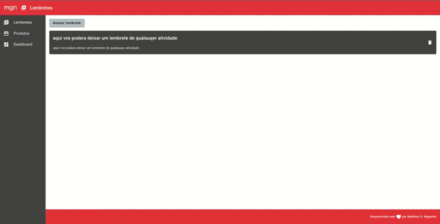

<h1 align="center">Cadastro de produtos | MGN </h1>

<p align="center">
  <a href="#-tecnologias">Tecnologias</a>&nbsp;&nbsp;&nbsp;|&nbsp;&nbsp;&nbsp;
  <a href="#-projeto">Projeto</a>&nbsp;&nbsp;&nbsp;|&nbsp;&nbsp;&nbsp;
  <a href="#-redes">Redes</a>
</p>

---

<p align="center">
  
</p>

---

## 🚀 Tecnologias

Esse projeto foi desenvolvido com as seguintes tecnologias:

- Angular
- Typescript
- Angular Material
- CSS
- Lib - Chart.JS
- Json-server

## 💻 Projeto

Esta aplicação foi desenvolvida para cadastro de produtos aonde permite indicar o valor do produto e também em um dashboard saber quantos produtos de cada categoria listada tem, como também anexar um lembrete com título e descrição. É uma aplicação simples para estudo e prática de utilização do Angular Material, estrutura de pastas, consumo de API e utilização da biblioteca Chart.JS para visualização de dados via dashboard.

---

### 1. Clonando o repositório

```
git clone https://github.com/eomgn/registerr-ng
```

### 2. Instalando as dependências

```
npm install
```

### 3. Inicializando o backend

```
Já no repositorio backend execute:
```

```
npm install > npm start
```

### 🎮 Rodando o projeto

```
1. Após iniciar o backend conforme a explicação acima.
```

```
2. Inicie o projeto com o comando CLI:
ng serve
```

```
3. Agora, abra seu navegador e navegue até: http://localhost:4200
```

---

## 🔗 Redes

Estas são minhas redes sociais. Sinta-se a vontade para mandar uma mensagem.

- [Linkedin](https://www.linkedin.com/in/eomgn/)
- [Instagram](https://www.instagram.com/matheuzngr/)
- [Twitter](https://twitter.com/eomgn)
